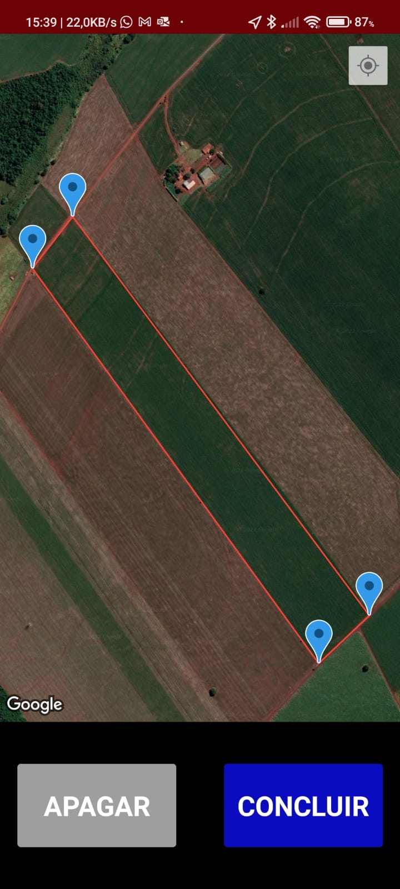
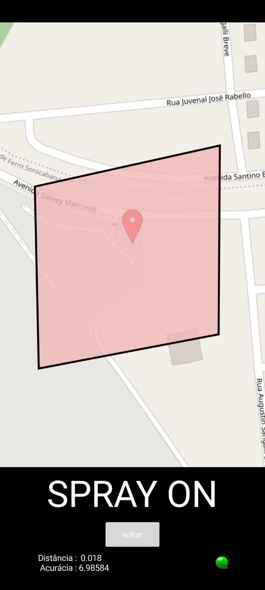
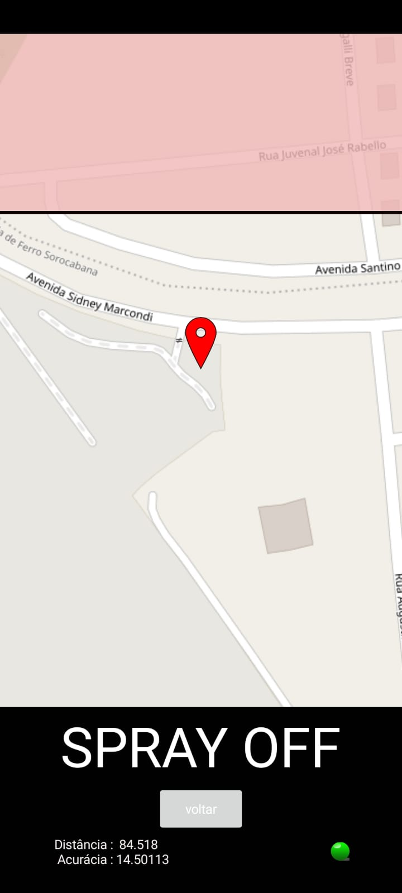

# AutoSpray
It's a simple spray on an off device that can be installed in any ag-spraying machine. Such as airplane and tractor
There are 2 releay isolated from each other and safely opto-coupled to the logical board. One controls wether the spray pump is on or off (it can handle a high current if necessary) and the other relay make a conecction for any exiting GPS and/or guidance system for logging porpouses.

The device is controlled via bluetooth by an android app.

The app was created with the kodular platform, wich is a derivation from the MITappInventor. The .aia file is the project and can easily be customizable

Once the user has an area or field selected. it can connect to the device and it will automatically detect the device position and activate the spray pump

It's worthy mention that an internet connection is necesasry to create the shape beforehand the spraying job, and then be saved in the android device. However internet isn't mandatory for the spraying itself, as it can be seen, there are diferent screens for each step of the process. In other words, the user would probably plan one's job at the office and only then move to the the field for the sprayin action.

Ther image belowa show the selection areas that are stored in the android device

All code were written by me and are avaiable in this repository. Also the eletronic schematics and pictures of the board can be found in this very repository.
